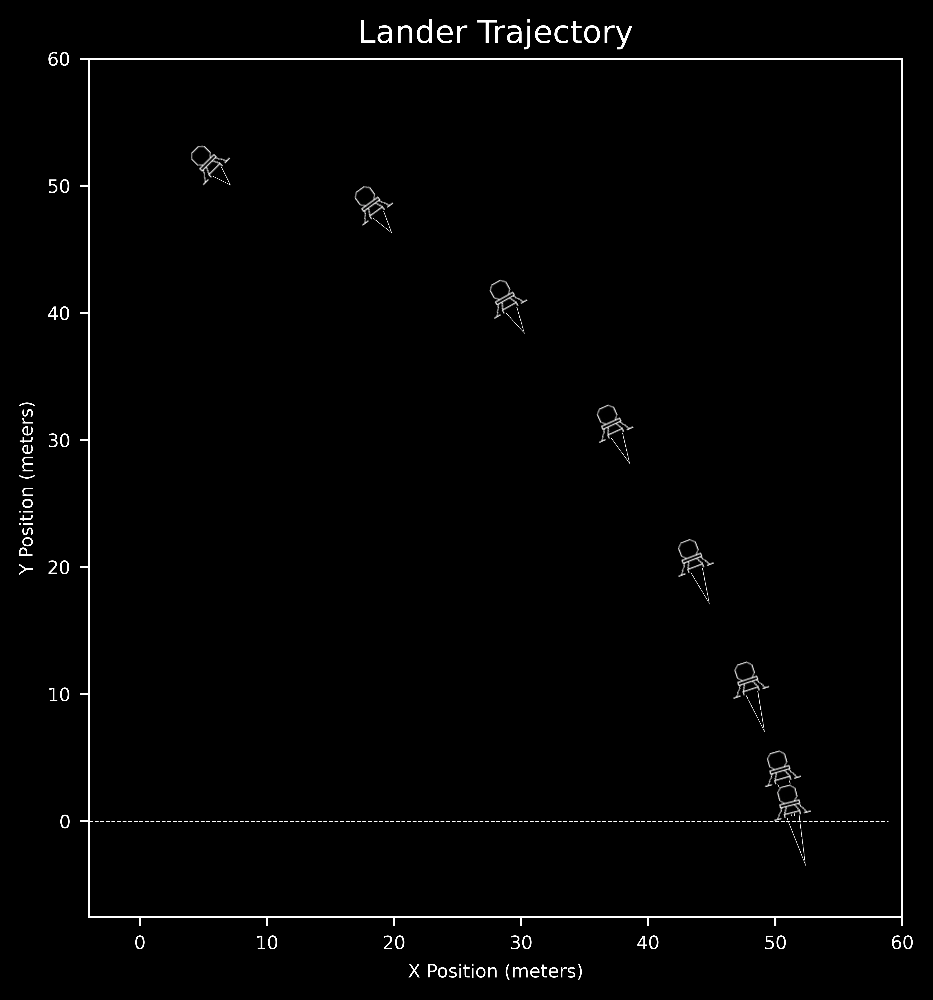
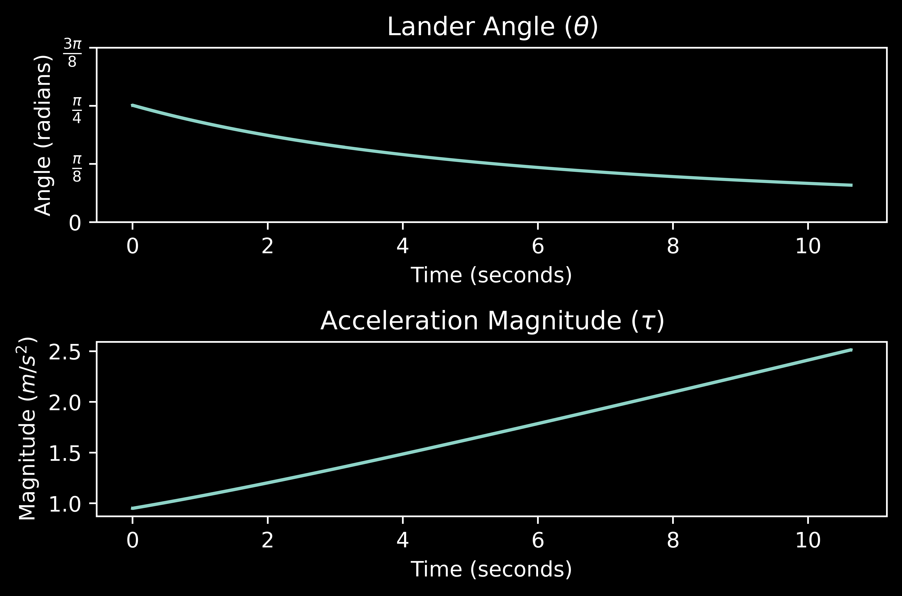
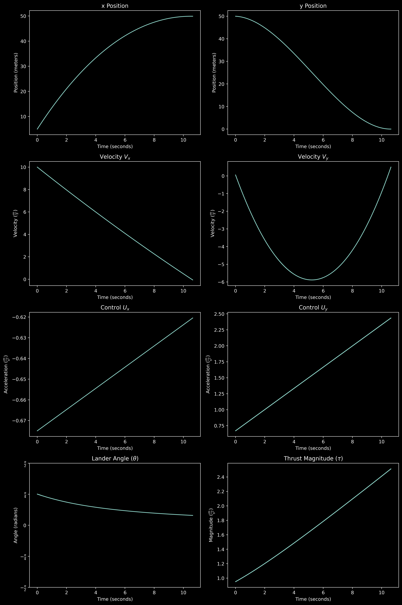
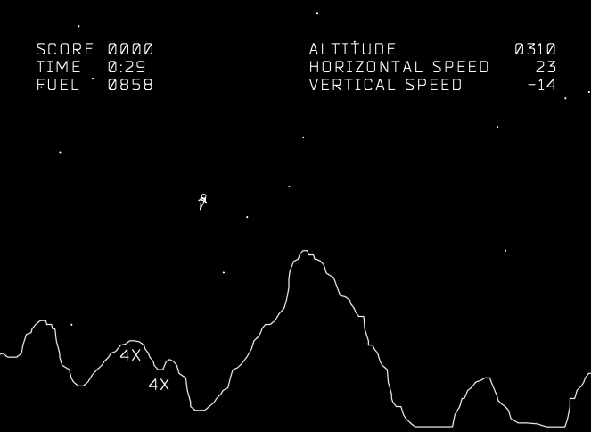

# Results (Gallery)

This page showcases a few baseline visuals. More figures and animations will be added over time.

## Baseline trajectory

The baseline trajectory shows the lander descending under gravity with optimal thrust to meet terminal conditions.

## Control summary

Control profiles over time (acceleration components, thrust magnitude, and angle) corresponding to the baseline run.

## Additional visuals

### Full output panel

A composite figure summarizing key states and controls.

### Thrust profile (full)

Detailed thrust and angle behavior across the approach.

### Gameplay reference

A reference still from gameplay to contextualize the control problem.

## Coming soon
- Obstacle-avoidance trajectories and contours
- Short animations (MP4)
- Additional comparisons across parameter choices

